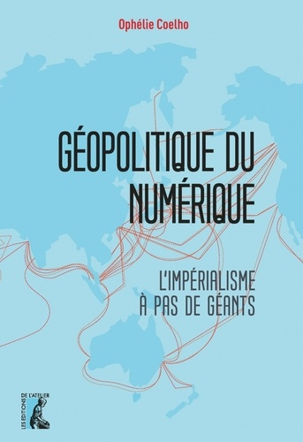
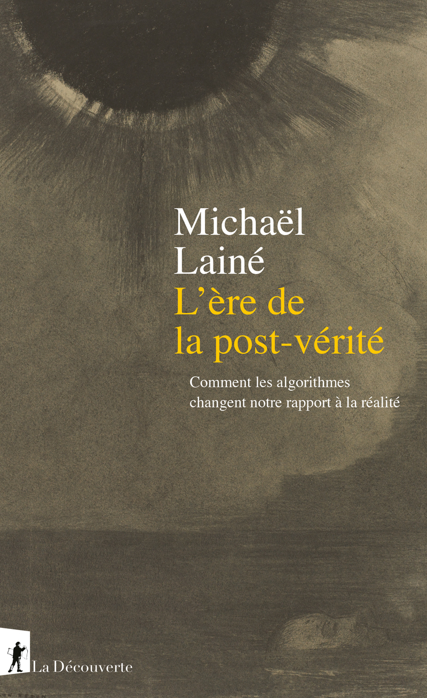
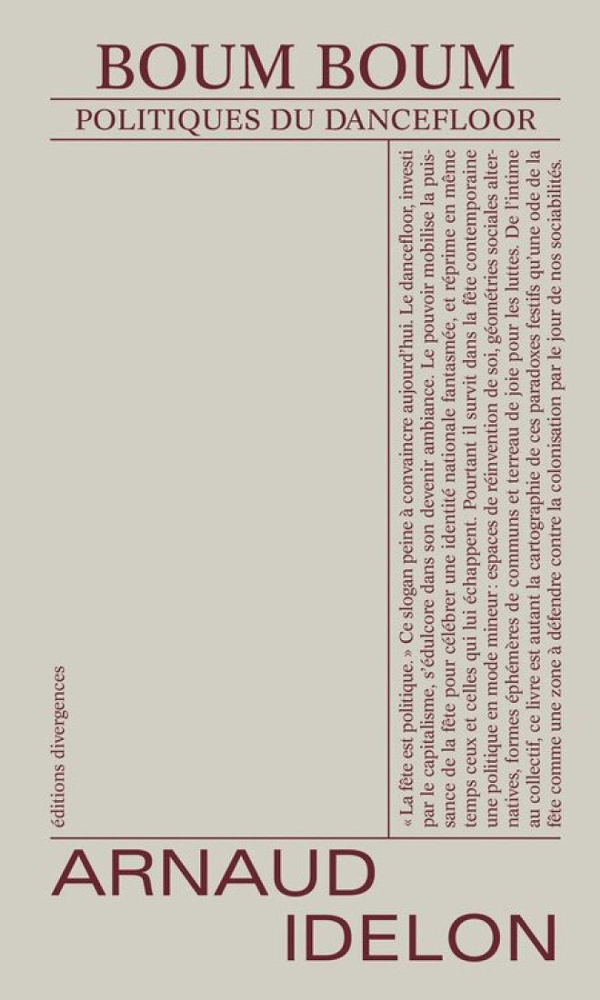
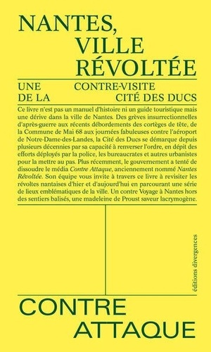
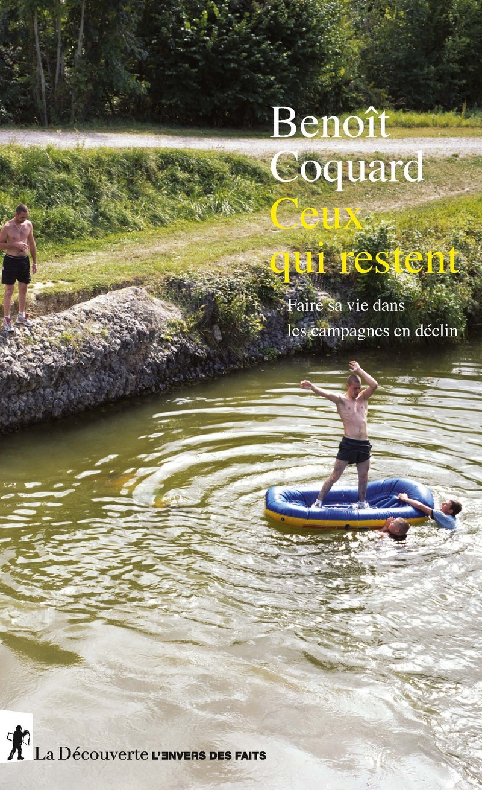

Bonne lecture...

## 2026

{width="10%" fig-align="left"}

{width="10%" fig-align="left"}

## 2025

{width="10%" fig-align="left"}

{width="10%" fig-align="left"}

{width="10%" fig-align="left"}

{width="10%" fig-align="left"}

{width="10%" fig-align="left"}

{width="10%" fig-align="left"}

{width="10%" fig-align="left"}

{width="10%" fig-align="left"}

{width="10%" fig-align="left"}

{width="10%" fig-align="left"}

{width="10%" fig-align="left"}